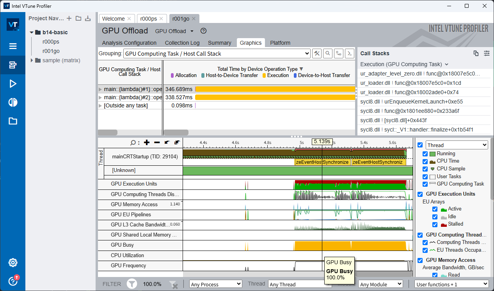

# Base16384-SYCL

A high-performance Base16384 encoding library implemented using Intel SYCL for accelerated computation on heterogeneous hardware platforms.

## Overview

> [!Note]
> This library requires Intel oneAPI DPC++/SYCL runtime. Please ensure proper environment setup before building and running the applications.

Base16384-SYCL is an optimized implementation of the [Base16384 encoding algorithm](https://github.com/fumiama/base16384) that leverages Intel SYCL (oneAPI Data Parallel C++) to achieve superior performance on both CPU and GPU architectures. The library provides efficient encoding and decoding capabilities while maintaining cross-platform compatibility.

## Features

- **Hardware Acceleration**: Utilizes Intel SYCL for parallel processing on CPUs, GPUs, and other accelerators
- **Cross-Platform Support**: Compatible with Windows and Unix-like systems
- **Performance Optimized**: Includes vectorization and memory optimization for maximum throughput
- **Robust Error Handling**: Comprehensive exception handling with detailed error reporting
- **Modern C++**: Written in C++20 with modern programming practices

## Prerequisites

### Required Dependencies

- **Intel oneAPI Toolkit**: DPC++/SYCL compiler and runtime
- **CMake**: Version 3.4 or higher

### Windows-Specific Requirements

- Visual Studio Build Tools or Visual Studio IDE
- Intel DPC++ compiler (icx-cl)
- NMake (included with Visual Studio)

### Unix/Linux Requirements

- Intel DPC++ compiler (icpx)
- Standard build tools (make, etc.)

## Installation

### 1. Environment Setup

> [!Tip] > **For VS Code Users**: If you're using Visual Studio Code, the environment variable setup commands will be executed automatically when you open a terminal. If this fails, it may be due to a non-standard installation path. Please modify the paths in `.vscode/settings.json` accordingly.

**Windows:**

```powershell
# Navigate to your Intel oneAPI installation directory
# Typically: C:\Program Files (x86)\Intel\oneAPI\
setvars.bat
```

**Linux/Unix:**

```bash
# Navigate to your Intel oneAPI installation directory
# Typically: /opt/intel/oneapi/
source setvars.sh
```

### 2. Build Process

**Clone and navigate to the project:**

```cmd
git clone https://github.com/fumiama/base16384-sycl.git
cd base16384-sycl
mkdir build
cd build
```

**Configure the build system:**

> Add `-DBUILD=test` to enable testing.

- Windows
  ```cmd
  cmake -G "NMake Makefiles" -DCMAKE_BUILD_TYPE=Release ..
  ```
- Unix-Like
  ```sh
  cmake -DCMAKE_BUILD_TYPE=Release ..
  ```

**Compile the project:**

```cmd
cmake --build .
```

### 3. Testing

**Run the test suite:**

```cmd
ctest
```

### 4. Performance Analysis with Intel VTune

Intel VTune Profiler is a powerful performance analysis tool that can help you identify bottlenecks and optimize the applications.

#### Prerequisites

- Intel VTune Profiler (included in Intel oneAPI Base Toolkit)
- Compiled Base16384-SYCL application or tests with debug symbols (use `RelWithDebInfo` build type)

#### Running VTune Analysis

**1. Launch VTune GUI:**

```bash
vtune-gui
```

**2. Create a New Project:**

- Click "New Project" in the welcome screen
- Set project name and location
- Configure the target application path

**3. Configure Analysis Type:**

Choose an analysis type based on your profiling goals:

- **Hotspots Analysis**: Identify CPU-intensive functions
- **GPU Offload Analysis**: Analyze GPU kernel performance and host-device data transfer
- **Memory Consumption**: Track memory usage patterns
- **Threading Analysis**: Detect threading issues and analyze parallelism

**4. Run the Analysis:**

- Click the "Start" button to begin profiling
- VTune will execute your application and collect performance data

**5. Analyze Results:**



**Key metrics to examine:**

- **Kernel Execution Time**: Time spent in SYCL kernels
- **Memory Transfer Overhead**: Host-to-device and device-to-host data transfer time
- **CPU Utilization**: Host CPU usage during GPU operations
- **GPU Utilization**: GPU compute unit occupancy

#### Optimization Tips

Based on VTune analysis, consider these optimization strategies:

1. **Reduce Host-Device Transfer**: Minimize data copying between CPU and GPU
2. **Increase Kernel Occupancy**: Optimize work-group sizes and global range
3. **Use Shared Memory**: Leverage local memory for frequently accessed data
4. **Batch Operations**: Process larger data chunks to amortize kernel launch overhead

## Build Configuration

The project supports multiple build configurations:

- **Release**: Optimized for maximum performance (`-O3`, `/O2`)
- **Debug**: Includes debugging symbols and reduced optimization
- **RelWithDebInfo**: Release optimization with debug information
- **MinSizeRel**: Optimized for minimal binary size

## Compatibility

- **Operating Systems**: Windows 10/11, Linux, macOS
- **Architectures**: x86-64, ARM64 (where Intel oneAPI is supported)
- **Hardware**: Intel CPUs, Intel GPUs, NVIDIA GPUs (via Level Zero), AMD GPUs (experimental)

## Contributing

Contributions are welcome! Please ensure that:

1. Code follows the existing style and conventions
2. All tests pass (`ctest`)
3. New features include appropriate test coverage
4. Documentation is updated for significant changes

## License

This project is licensed under the GNU General Public License v3.0 (GPL-3.0). See the [LICENSE](LICENSE) file for detailed information.

## Acknowledgments

- Intel oneAPI team for the SYCL implementation
- Base16384 algorithm developers
- Contributors to the open-source community
